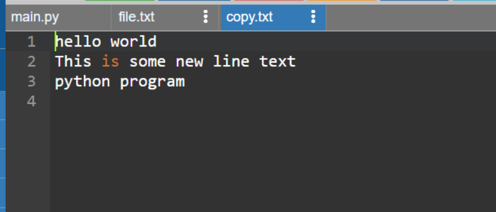

# copy-file
## AIM:
To write a python program for copying the contents from one file to another file.
## EQUIPEMENT'S REQUIRED: 
PC
Anaconda - Python 3.7
# ALGORITHM:
# Step 1:
Create a file.
# Step 2:
Write some lines in that file.
# Step 3:
Create a python file.
# Step 4:
Write a code to copy the content of the file to a new file.
# Step 5:
Run the program.
# Step 6:
Display the output.

## PROGRAM:
```
with open("file.txt",'r') as file:
with open("copy.txt",'w') as file2:
line=file.read()
file2.write(line)
```

### OUTPUT:




## RESULT:
Thus the program is written to copy the contents from one file to another file.